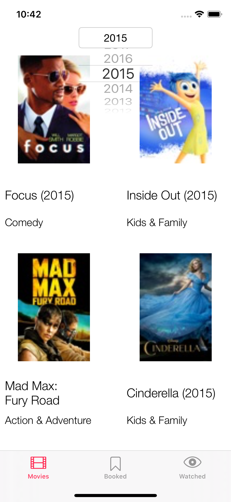
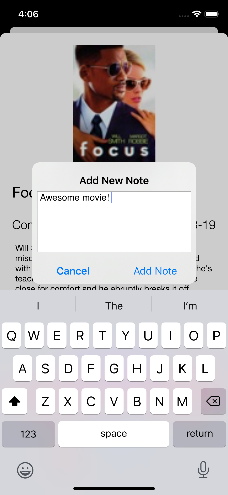

#  OpenClassrooms - iOS developer path - iOS Project 9
## PopCornSwirl - Portrait (iPhones and iPads)
## Core Data - JSONSerialization - GoogleMobileAds

This application uses ["iTunes as Movies data base"](https://itunes.apple.com/)  

 

This application lets the user add/remove movies to their watched and/or favorite list using core Data. 
The user can write a note for a movie. These notes are saved locally using Core Data.

## Launch Screen

 

## Initial Screens
The user first sees the latest movies in the current year.  

 

Then the user can select a particular year from the dropdown menu on the top to see movies that were released in that year. 

 

The user can tap on any movie to see the movie's extended details with an ad banner displayed on the bottom, and the user can decide to tap on the "Bookmark" button to create a personal list of favourite movies. 

 

The user can decide to tap on the "AddToWatched" button to add the movie to Watched list, and then the user can add a note for the watched movie if desired.  

 

The user can view the note and edit it at any time. 

 

## Favourite and Watched lists
The user can tap on any movie again to see the movie extended details, the user can unbookmark the movie and/or move it to a different list by tapping on "Bookmark" / "AddToWatched" buttons.   

 

